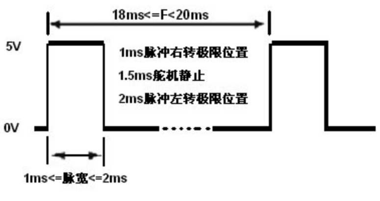

# 舵机简介

舵机是一种位置伺服的驱动器，适用于那些需要角度不断变化并可以保持的控制系统。

## 基本工作原理

控制信号由接收机的通道进入信号调制芯片，获得直流偏置电压。

它内部有一个基准电路，产生周期为20ms，宽度为1.5ms的基准信号，将获得的直流偏置电压与电位器的电压比较，获得电压差输出。

最后，电压差的正负输出到电机驱动芯片决定电机的正反转。当电机转速一定时，通过级联减速齿轮带动电位器旋转，使得电压差为0，电机停止转动。

# 9克舵机的常见参数

## 产品参数

名称：9克舵机180度
尺寸：23mm X 12.2mm X 29mm
重量：9克
扭矩：1.5kg/cm
工作电压：4.2 - 6V
温度范围：0 - 55℃
运行速度：0.3s/60℃
死带宽：10ms

## 舵机有三条线定义：

最深色（如暗灰）：GND
次深色（如红色）：VCC 4.8V - 7.2V
最浅色（如橙黄）：脉冲输入

## 舵机控制

舵机的控制一般需要一个20ms左右的时基脉冲，该脉冲的高电平部分一般为0.5ms~2.5ms范围内的角度控制脉冲部分。以180度角度伺服为例，那么对应的控制关系是这样的：

```
0.5ms-----------  0度；
1.0ms----------- 45度；
1.5ms----------- 90度；
2.0ms-----------135度；
2.5ms-----------180度；
```
以上只是一种参考数值，具体的参数，请参见舵机的技术参数。

注意：我们的代码示例中，使用的是微秒（us），不是毫秒（ms）。


## 利用 PWM 控制

舵机的控制信号是PWM信号，利用占空比的变化改变舵机的位置。一般舵机的控制要求如下图所示




# Arduino Servo 库的API


```
/*#include <Servo.h>                           // 引用 ESP8266 伺服舵机 功能库文件
  Servo servo;                                 // 创建舵机对象
  servo.attach(数字引脚,[1000],[2000]);         // 连舵机黄线的引脚,脉冲信号一般设为 500微秒 到 2500微秒
  servo.attached();                            // <bool>获取舵机对象是否已经连接引脚
  servo.detach();                              // 断开引脚控制,使对象不再控制任何舵机

  servo.write(新角度值);                        // 控制转动舵机,数值<200视为角度,否则为脉冲时间(微秒)
  servo.read();                                // <int>获取最后一次write()命令的角度值,0-180 之间
  servo.writeMicroseconds(新脉冲值);            // 控制转动舵机,发送信号脉冲宽度值 500-2500 微秒之间
  servo.readMicroseconds();                    // <int>获取最后一次writeMicroseconds()命令脉冲值

  ESP8266开发板数字引脚 D0-D8 总共9个引脚可用来控制舵机,其中有个引脚与板载LDE灯共享请慎用..
  库文件Servo.cpp里值<200才视为角度,对270度的舵机建议用writeMicroseconds().注意:360度舵机不能控制角度的

  9克舵机从一个角度转到另一个角度需要时间,约120毫秒60度.从0度转到180度需要360毫秒,1秒=1000毫秒=100000微秒
  调用write() 5微秒就能返回,同时write()多个舵机,就能看到多舵机同时转动的效果.
  当我们希望舵机是一个接一个轮流转动,或者转到目标角度后再其他操作,可在调用write()后可以再适当的延时 delay();
```

## 9克舵机使用的注意事项


```
   控制舵机的高电平脉冲信号在周期20000微秒里占用500-2500微秒时间控制舵机转到指定角度..模拟舵机要持续发信号直到目标角度..
    500微秒----------0度；   1秒=1000毫秒，1毫秒=1000微秒
   1000微秒---------45度；
   1500微秒---------90度；
   2000微秒--------135度；
   2500微秒--------180度；

   高电平脉冲每 11.11微秒≈1度≈(2500-500)/180,所以1微秒≈0.1度  不用太较真..

   SG90,TS90A 空载转速:0.12秒/60度(4.8V)=120毫秒60度=2毫秒1度
   SG90 工作电压4.8V~6V  待机5ma,空载60ma,工作电流>300ma.最大负载电流700ma.  堵转扭矩:1.2~1.4公斤/厘米(4.8V)

   注意:电脑蓝色USB3.0插口输出5V900ma电流，，黑色USB2.0输出5V500ma电流(电流严重不够)....
   插电脑USB3.0调试六轴机械臂勉强能用.可外接 5V2a+手机电源 或其他5V8a电源

   舵机三根电线  黄线->接信号(D0~D8),红线->接正极(5V),褐线->接负极(G)

```
