# ESP8266-wifi 板子

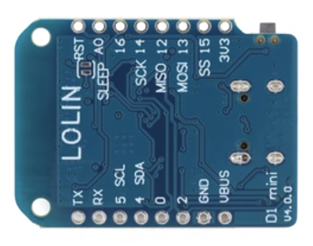

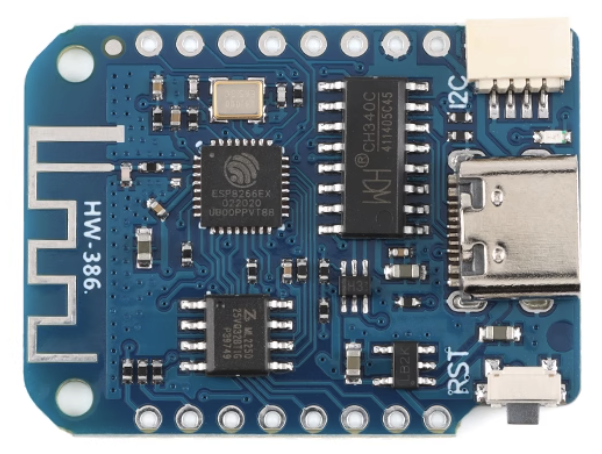

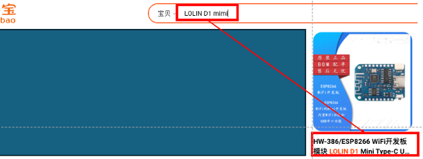


# 编程环境的建立步骤

## 第一步：为你的 Arduino 装上 ESP8266和ESP32的开发板扩展库功能和串口驱动

-Arduino左上角菜单 文件->首选项 出来的设置窗口可以看到  附加开发板管理器网址  添加以下两个网址进去，用逗号分隔，如下所示：
-https://arduino.esp8266.com/stable/package_esp8266com_index.json,https://dl.espressif.com/dl/package_esp32_index.json


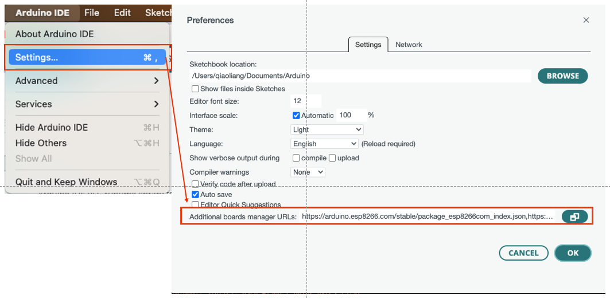

## 第二步：安装 esp8266 对应的库文件

- 左上角菜单 工具->开发板->开发板管理器 ，搜  esp8266 ，并安装 esp8266  by ESP8266 Community 最新版本,或者搜  esp32 安装这个  by Espressif Systems 最新版本...
- 慢慢等待平台索引下载完成，因为服务器在国外,下载要耐心,,若中断了再重新下载...


## 第三步：安装本程序所依赖的另外两个库文件

- arduino 工具->管理库 搜 `Blinker` , 然后点击安装.
- arduino 工具->管理库 搜 `ArduinoJson` ，然后安装

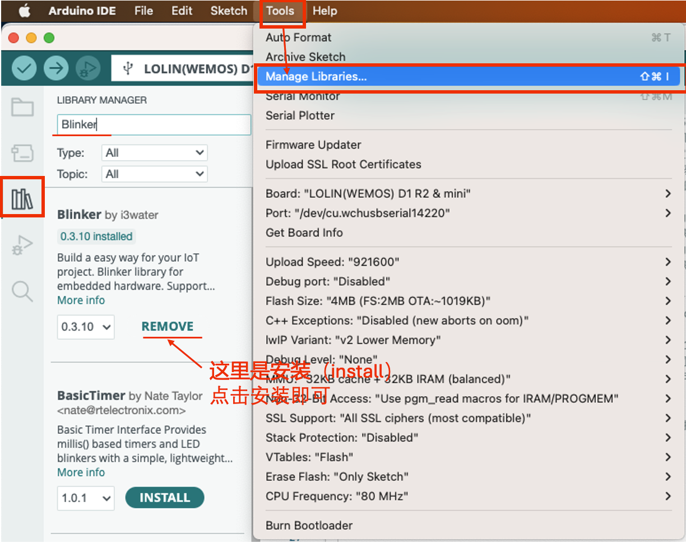
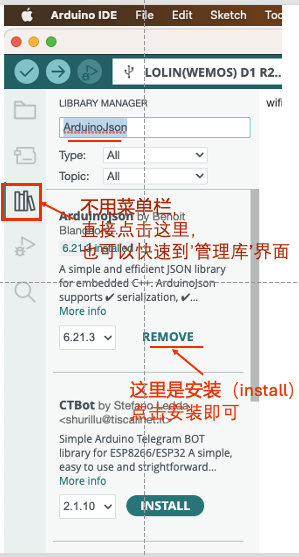

## 第四步：安装esp 8266 板子上所需要的 串口到USB的 CH341 串口驱动

- macOS 系统的驱动下载地址：https://www.wch.cn/download/CH341SER_MAC_ZIP.html

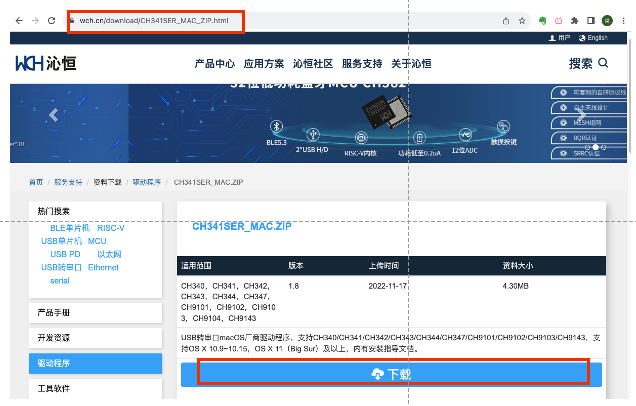

- 下载后，先解压，再双击安装。安装好以后，再运行。

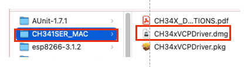

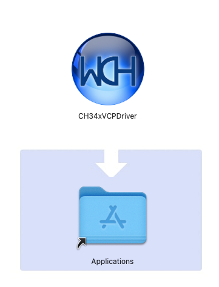


- 安装好以后，你会在 /dev/ 目录下看到两个新设备，这个设备的名字是以 cu. 开头的。 使用 `ls /dev/cu.*`命令，会显示类似下面的输出，后面两个就是这个驱动激活的端口。

```
-/dev/cu.BLTH
-/dev/cu.Bluetooth-Incoming-Port
-/dev/cu.usbserial-14120
-/dev/cu.wchusbserial14120
```

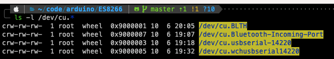


## 第五步：将type-C 口连到板卡上，USB口 连接到macOS上。

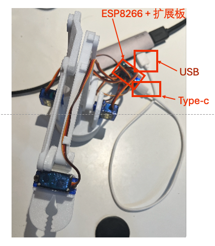


## 第六步：在arduino开发环境上配置 board 和 port

- 在 arduino 主菜单上， 工具->开发板 esp8266 分类中找到 “LOLIN (WEMOS) D1 R2 & mini” 这项选择即可,


- 在 arduino 主菜单 工具->端口  选中一个在你插入开发板后多出来的 COM (例如：cu.usbserial-14120),如果不对,再换一个选试试...或换一根数据线连电脑

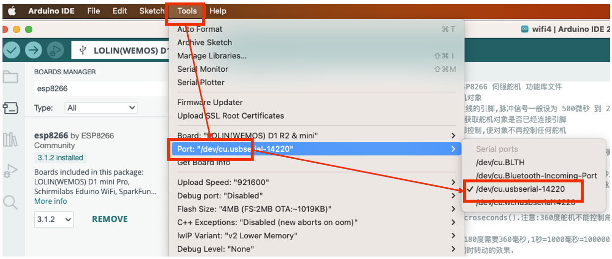

## 第七步：在IDE的 串口输出，一定要设置波特率为 115200，否则看到的都是乱码。

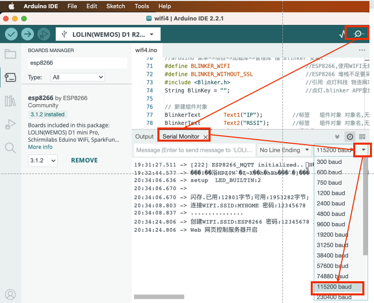

## 第八步：编译程序，并烧录到板卡上。

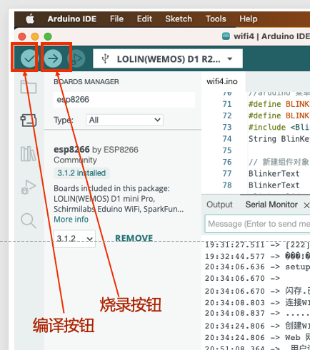


## 第九步：通过电脑上的浏览器来操作机械臂

1. 把电脑的 Wifi 连接到 ESP8266 的 wifi服务器上，密码是 12345678

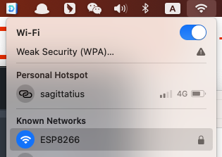


2.打开浏览器，访问 http://192.168.1.1

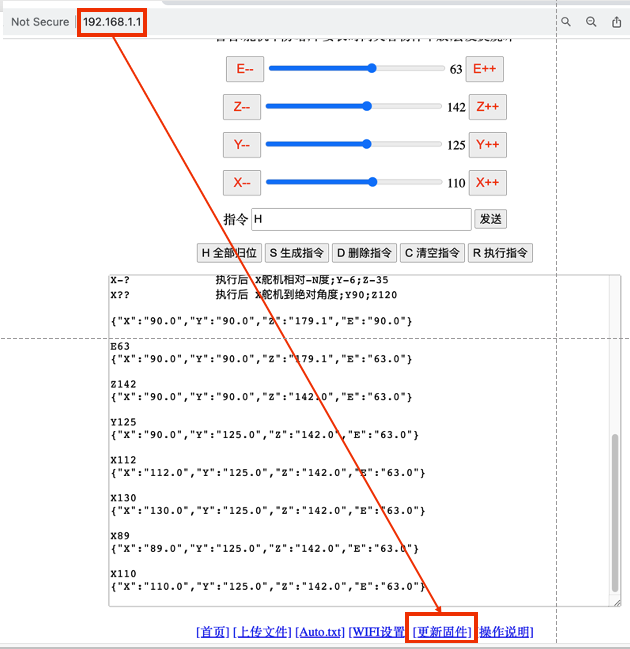

3. 通过点击页面上的滑块来控制机械臂


# 通过网页更新固件


1. 在 arduino菜单 项目->导出已编译的二进制文件 .bin

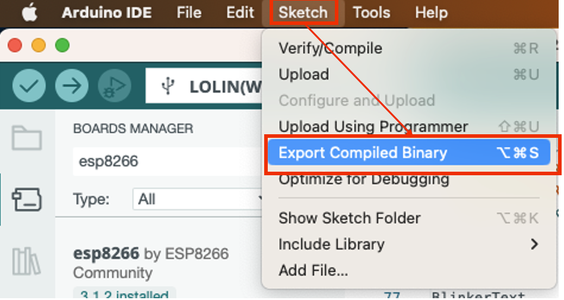

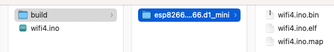


2. 参考上面的「第九步」，把电脑的 Wifi 连接到 ESP8266 的 wifi服务器上，密码是 12345678

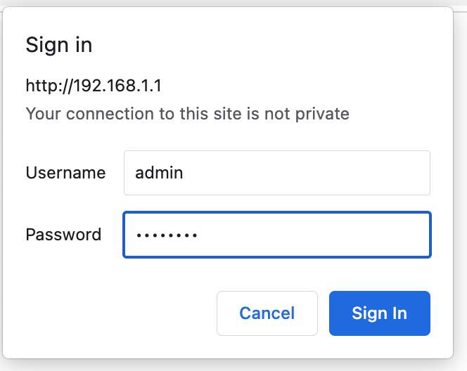

3. 在网页里点 [更新固件],帐号 admin 密码12345678，点 Firmware 选择新生成的 .bin文件，点 Update Firmware 更新固件代码.


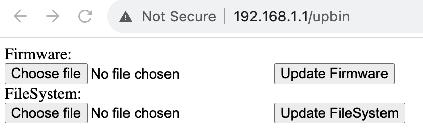


