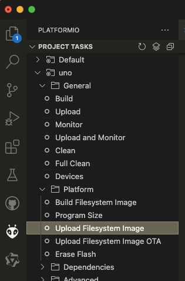
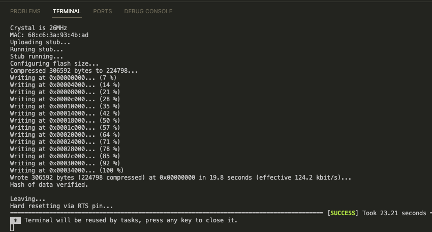
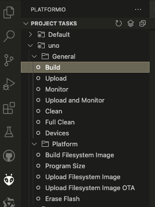
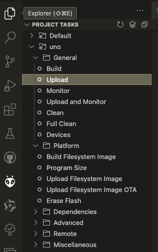

# 数据文件的准备

## 1. 数据文件 wifi_config.json 的创建

首先，我们需要在项目根目录下创建一个名为  `data` 的目录，目录结构如下所示：

```
data/
└── wifi_config.json

```
其中, `wifi_config.json` 是WiFi 配置文件。

## 2. wifi_config.json 的内容

在 `data/wifi_config.json` 中：

```
{
    "STA_SSID": "STA_SSID",
    "STA_PASSWORD": "STA_PASSWORD",
    "AP_SSID": "AP_SSID",
    "AP_PASSWORD": "AP_PASSWORD"
}
```

## 3. 上传到 ESP8266 设备

1. 点击 `platformio` 菜单，选择 `Upload Filesystem Image` 选项，将 `data` 目录上传到 ESP8266 设备。




2. 如果上传成功，将会在终端中显示如下信息：

```
|-- LittleFS @ 0.1.0
Building in release mode
Building file system image from 'data' directory to .pio/build/uno/littlefs.bin
/wifi_config.json
Looking for upload port...
Auto-detected: /dev/cu.wchusbserial14120
Uploading .pio/build/uno/littlefs.bin
esptool.py v3.0
Serial port /dev/cu.wchusbserial14120
Connecting....
Chip is ESP8266EX
Features: WiFi
Crystal is 26MHz
MAC: 68:c6:3a:93:4b:ad
Uploading stub...
Running stub...
Stub running...
Configuring flash size...
Compressed 1024000 bytes to 1342...
Writing at 0x00300000... (100 %)
Wrote 1024000 bytes (1342 compressed) at 0x00300000 in 0.1 seconds (effective 67561.1 kbit/s)...
Hash of data verified.

Leaving...
Hard resetting via RTS pin...
================== [SUCCESS] Took 8.98 seconds ===
```




## 4. 编译代码

在 `platformio` 菜单中，选择 `Build` 选项，上传到 ESP8266 设备。



## 5. 烧写固件

在 `platformio` 菜单中，选择 `Upload` 选项，上传到 ESP8266 设备。



## 6. 连接 ESP8266 设备

将 ESP8266 设备连接到电脑，并打开串口监视器。
重启 ESP8266 设备后，将会在终端中显示如下信息：

```
wifi_config.json exist. Using Existed Configuration on Chip.
main: init wifi config loaded from data file.
main: fs available.
main: fs dir: 闪存.已用:24576字节;可用:1024000字节;
wifi_config.json	136

STA_SSID : I_am_STA_SSID
STA_PASSWORD : I_am_STA_PASSWORD
AP_SSID : your_AP_SSID
AP_PASSWORD : your_AP_PASSWORD
```