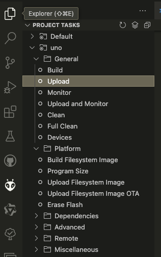

# 简介

本项目是基于 ESP8266 开发板，使用 `ESP8266 Arduino Core` 库，并使用 `LittleFS` 库来存储数据。

# 硬件准备

## 1. ESP8266 开发板

### 1.1 ESP8266 开发板简介

ESP8266 是 Espressif Systems 公司开发的 Wi-Fi 模块，基于 8051 处理器，具有 1MB 的 Flash 和 520KB 的 SRAM。

### 1.2 硬件连接

ESP8266 开发板与电脑通过 USB 连接。

# 软件准备

## 1. 下载并安装 `platformio`

打开终端，输入以下命令，下载并安装 `platformio`：

```
pip install -U platformio
```

## 2. 下载并安装 `ESP8266 Arduino Core`

打开终端，输入以下命令，下载并安装 `ESP8266 Arduino Core`：

```
platformio platform install espressif8266
```

# 项目的创建

## 1. 创建项目

打开终端，输入以下命令，创建项目：

```
platformio init --board uno
```

## 2. 项目结构

创建项目后，项目结构如下所示：

```
|-- platformio.ini
|-- src
|   |-- main.cpp
|-- data
|   └── wifi_config.json
```
其中，`platformio.ini` 是 `platformio` 的配置文件，`src/main.cpp` 是程序的入口文件，`data/wifi_config.json` 是 WiFi 配置文件。

# 程序的编写

## 1. main.cpp 的内容

在 `src/main.cpp` 中，我们编写如下程序：

```cpp
#include <Arduino.h>
#include <LittleFS.h>

void setup() {
    Serial.begin(115200);
    Serial.println("Hello World!");
}

void loop() {
}
```
在 `setup()` 函数中，我们使用 `Serial.begin()` 函数来设置串口通信的波特率为 115200，并打印 “Hello World!”。

在 `loop()` 函数中，我们什么都不做。

## 2. 编译和上传程序

在终端中，输入以下命令，编译并上传程序：

```
platformio run -t upload
```
# 程序的运行

在终端中，输入以下命令，查看串口输出：

```
platformio device monitor
```
# 程序的调试

在终端中，输入以下命令，调试程序：

```
platformio device monitor -d
```
# 程序的烧录

在终端中，输入以下命令，烧录程序：

```
platformio run -t uploadfs
```
# 程序的运行

在终端中，输入以下命令，查看串口输出：

```
platformio device monitor
```

# 程序的调试

在终端中，输入以下命令，调试程序：

```
platformio device monitor -d
```


# 数据文件的准备

## 1. 数据文件 wifi_config.json 的创建

首先，我们需要在项目根目录下创建一个名为  `data` 的目录，目录结构如下所示：

```
data/
└── wifi_config.json

```
其中, `wifi_config.json` 是WiFi 配置文件。

## 2. wifi_config.json 的内容

在 `data/wifi_config.json` 中：

```
{
    "STA_SSID": "STA_SSID",
    "STA_PASSWORD": "STA_PASSWORD",
    "AP_SSID": "AP_SSID",
    "AP_PASSWORD": "AP_PASSWORD"
}
```

## 3. 上传到 ESP8266 设备

1. 点击 `platformio` 菜单，选择 `Upload Filesystem Image` 选项，将 `data` 目录上传到 ESP8266 设备。


2. 如果上传成功，将会在终端中显示如下信息：

```
|-- LittleFS @ 0.1.0
Building in release mode
Building file system image from 'data' directory to .pio/build/uno/littlefs.bin
/wifi_config.json
Looking for upload port...
Auto-detected: /dev/cu.wchusbserial14120
Uploading .pio/build/uno/littlefs.bin
esptool.py v3.0
Serial port /dev/cu.wchusbserial14120
Connecting....
Chip is ESP8266EX
Features: WiFi
Crystal is 26MHz
MAC: 68:c6:3a:93:4b:ad
Uploading stub...
Running stub...
Stub running...
Configuring flash size...
Compressed 1024000 bytes to 1342...
Writing at 0x00300000... (100 %)
Wrote 1024000 bytes (1342 compressed) at 0x00300000 in 0.1 seconds (effective 67561.1 kbit/s)...
Hash of data verified.

Leaving...
Hard resetting via RTS pin...
================== [SUCCESS] Took 8.98 seconds ===
```


## 4. 编译代码

在 `platformio` 菜单中，选择 `Build` 选项，上传到 ESP8266 设备。


## 5. 烧写固件

在 `platformio` 菜单中，选择 `Upload` 选项，上传到 ESP8266 设备。



## 6. 连接 ESP8266 设备

将 ESP8266 设备连接到电脑，并打开串口监视器。
重启 ESP8266 设备后，将会在终端中显示如下信息：

```
wifi_config.json exist. Using Existed Configuration on Chip.
main: init wifi config loaded from data file.
main: fs available.
main: fs dir: 闪存.已用:24576字节;可用:1024000字节;
wifi_config.json	136

STA_SSID : I_am_STA_SSID
STA_PASSWORD : I_am_STA_PASSWORD
AP_SSID : your_AP_SSID
AP_PASSWORD : your_AP_PASSWORD
```

## 注意事项

- 请确保 `platformio.ini` 文件中启用了 littlefs 选项。

- 请确保 `wifi_config.json` 文件的路径在 `data` 目录下，并且文件名为 `wifi_config.json`，否则将无法正常工作。
- 请确保 `wifi_config.json` 文件的格式正确，否则将无法正常工作。
- 请确保 `wifi_config.json` 文件的大小在 1024000 字节以内，否则将无法正常工作。
- 请确保 `wifi_config.json` 文件的编码格式为 UTF-8，否则将无法正常工作。

