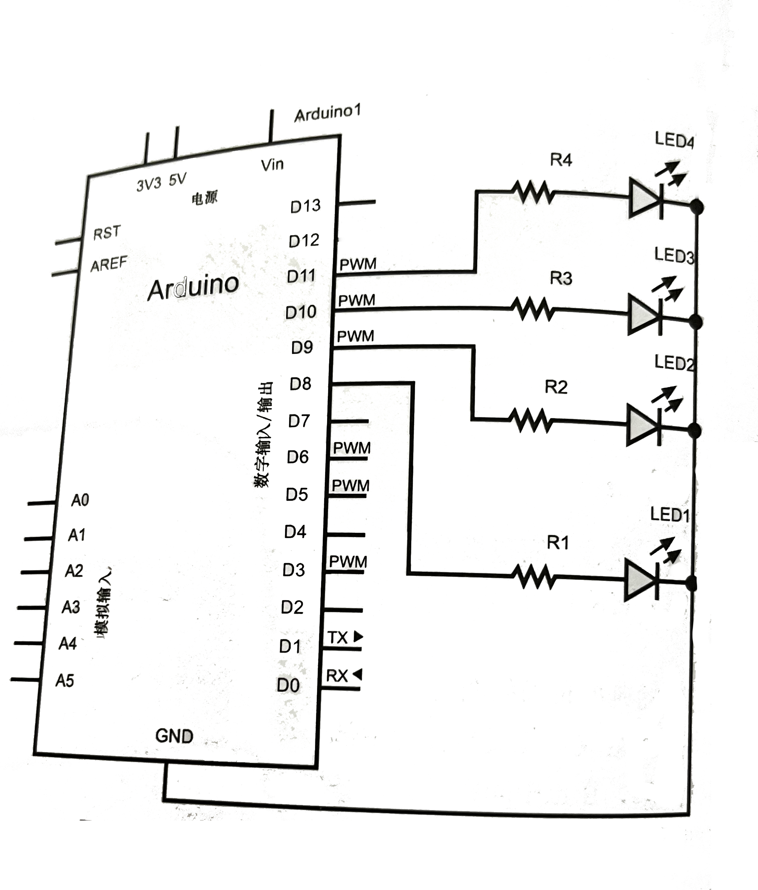
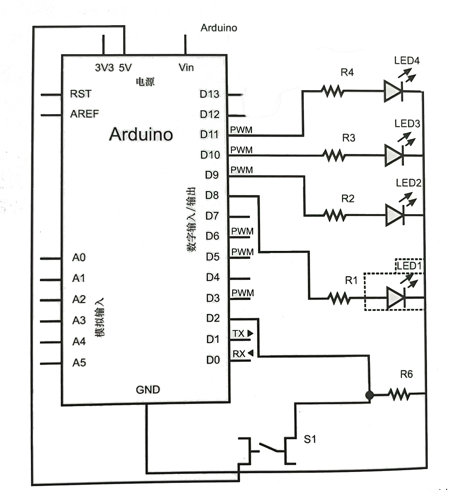

## 发光二极管


一般来说，

1. 短引脚是负极，要接地（GND），而长引脚是正极。
2. 发光二极管有对应的额定电压。而 USB 的电压为 5V。所以，在使用时，需要串联一个电阻 R，使发光二组管的电流不超过 20mA（一般来说，发光二极管的额定电流）。


|二级管的颜色 |二级管的额定电压 V|应该串联的电阻 R|
|:---:|---:|---:|
|红色，黄色，橙色|1.5v|175 欧|
|绿色 | 2V | 150 欧 |
|蓝色，白色 | 3V |100 欧|


# 练习

## 练习 1：闪烁的LED灯

## 接线方法


## 代码

```
// arduinoimg/01.BLink_LED.png         //接线图

const int LED=13;           //定义 LED 引脚为 13

void setup()
{
  pinMode(LED,OUTPUT);      // 定义 13 为输出引脚
}

void loop()
{
  digitalWrite(LED,HIGH);   // 设定 LED 为高电平，即点亮
  delay(1000);              // 持续 1 秒
  digitalWrite(LED,LOW);    // 设定 LED 为低电平，即熄灭
  delay(1000);              // 持续 1 秒

}

```

## 练习 2：四个闪烁的LED灯

## 材料准备


## 接线方法



## 实物连线图


## 代码

```
int ledArray[]={8,9,10,11};         // LED 数组
int count = 0;
int timer =75;

void setup()
{
  for(count =0;count <4;count ++)       // 设置 4 个 LED 的引脚输出
  {
    pinMode(ledArray[count],OUTPUT);
  }
}

void loop()
{
  for(count =0;count <4;count ++)
  {
    digitalWrite(ledArray[count],HIGH);
    delay(1000);
    digitalWrite(ledArray[count],LOW);
    delay(1000);
  }
}
````


## 练习3: 用开关控制四个闪烁的LED灯

## 材料准备

练习2的材料  + 一个按钮 + 10KΩ 的电阻


## 接线方法



## 实物连线图


## 代码

```
volatile int state = LOW;
int ledArray[]={8,9,10,11};         // LED 数组
int count = 0;
int timer =75;
int pause = 500;

void setup()
{
  for(count =0;count <4;count ++)       // 设置 4 个 LED 的引脚输出
  {
    pinMode(ledArray[count],OUTPUT);
  }
  attachInterrupt(0,ledOnOff,RISING);   // 初始化中断
}

void loop()
{
  if (state)
  {
    for(count =0;count <4;count ++)       //
    {
      digitalWrite(ledArray[count],HIGH);
      delay(timer);
    }
    delay(pause);
  }
}

void ledOnOff()
{
  static unsigned long lastMillis = 0;
  unsigned long newMillis = millis();
  if(newMillis - lastMillis < 50)         // 进行button的消抖处理
  {
  }else{
    state = !state;
    lastMillis = newMillis;
  }
}
```

